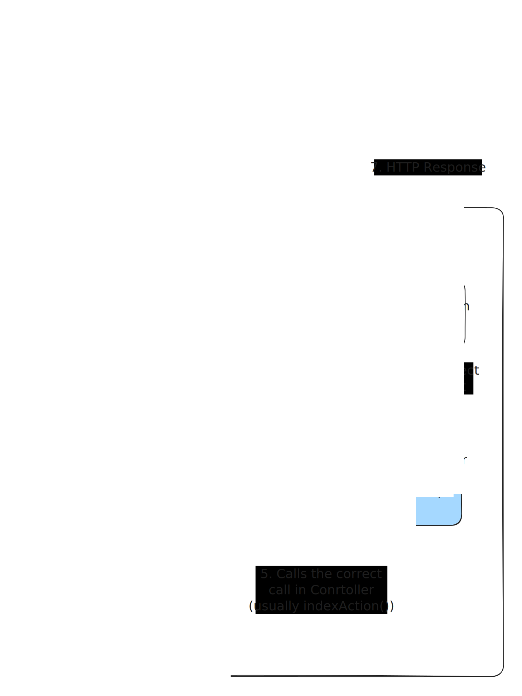

# PHP & Symfony

- Contains setup and usage details related to legacy `symfony 3.3.16` framework running with `php 7.2`.

## Table of Contents

- [Setup \& Installation](#setup--installation)
  - [`php7.2`](#php72)
  - [Composer (1 and 2)](#composer-1-and-2)
  - [Creating a New Project in `symphony 3.3.16`](#creating-a-new-project-in-symphony-3316)
- [Run Webserver (Dev)](#run-webserver-dev)
- [Backend: Symfony Architecture \& Request Flow](#backend-symfony-architecture--request-flow)
- [Symfony Console (Basics)](#symfony-console-basics)

## Setup & Installation

> **NOTE**: Skip this step if setup and installation is already completed.

- Contains instructions for the following software packages and/or tools:
  - [PHP 7.1](#php72)
  - [Composer (1 and 2)](#composer-1-and-2)
  - [Creating a New Project in `symphony 3.3.16`](#creating-a-new-project-in-symphony-3316)

[:arrow_double_up:](#table-of-contents)

### `php7.2`

- The following software/tools will be required to start a `symfony 3.3.16` project using `php 7.2`:

  ```sh
  # Ensure that software common properties is installed
  sudo apt install software-properties-common -y

  # Add ondrej's php repository to ppa
  sudo add-apt-repository ppa:ondrej/php -y

  # Update the repositories list
  sudo apt update

  # Install PHP 7.2
  sudo apt install php7.2 php7.2-fpm php7.2-mysql php7.2-xml php7.2-mbstring php7.2-curl php7.2-gd -y
  ```

  In case you already have a version of PHP installed, you can change the default to point to `php7.2`:

  ```sh
  # Interactive usage
  # sudo update-alternatives --config php

  # Recommended direct setup
  sudo update-alternatives --set php /usr/bin/php7.2
  ```

[:arrow_double_up:](#table-of-contents)

### Composer (1 and 2)

- Download/Install `composer` (for legacy `symfony` projects, download and install `composer-1`, otherwise stick to `composer-2`):
  > For running `symfony 3.3.16` projects, `composer-1.x` with `php7.2` works best.
  - For legacy symfony projects, download [`composer-1.x`](https://getcomposer.org/composer-1.phar), and do the following

    ```sh
    # Create a local binaries directory
    sudo mkdir -p /usr/local/bin
    
    # Copy the PHP archive (.phar) file to /usr/local/bin
    sudo cp /path/to/composer-1.phar /usr/local/bin/composer1

    # Make the file executable
    sudo chmod +x /usr/local/bin/composer1

    # Create a symbolic link called /usr/local/bin/composer that points to /usr/local/bin/composer1
    sudo ln -s /usr/local/bin/composer1 /usr/local/bin/composer
    ```

    **NOTE**: In case there's a need to change to the latest version of `composer`, then create a new symbolic link in `/usr/local/bin/` and point it to the required binary.

  - For newer projects follow the [official guide](https://getcomposer.org/download/), or follow the following steps:
    - Download [`composer-2.x` (latest)](https://getcomposer.org/https://getcomposer.org/composer.phar), and follow the same steps as mentioned for `composer-1.x`, except this time, copying/moving/renaming the file would be as `/usr/local/bin/composer2`.

[:arrow_double_up:](#table-of-contents)

### Creating a New Project in `symphony 3.3.16`

- Create a `symfony 3.3.16` project:
  
  ```sh
  git clone --branch v3.3.16 https://github.com/symfony/symfony-standard.git my_project_name
  cd my_project_name

  # Ensure that composer is pointing to composer1 (not v2)
  composer install
  ```

  After running `composer install`, composer will prompt the user for some parameters for the project which will be important to set. The parameters are the following:

  ```terminal
  database_host (127.0.0.1):
  database_port (null): 
  database_name (symfony):
  database_user (root):  
  database_password (null):
  mailer_transport (smtp):
  mailer_host (127.0.0.1):
  mailer_user (null):
  mailer_password (null):
  secret (ThisTokenIsNotSoSecretChangeIt):
  ```

  > **NOTE**: It's a good practive to use user-specific values for `database_name`, `database_user`, and `database_password`.  Rest all can be configured later.

[:arrow_double_up:](#table-of-contents)

## Run Webserver (Dev)

> **NOTE**: Complete the steps in [Setup & Installation](#setup--installation), otherwise the server won't run.

- Run the webserver on `localhost` (by default, the server runs on port `8000`) from inside the created project:

  ```sh
  php bin/console server:run
  ```

- You should be able to open the server on <http://localhost:8000> (or <http://127.0.0.1:8000>).

[:arrow_double_up:](#table-of-contents)

## Backend: Symfony Architecture & Request Flow



[:arrow_double_up:](#table-of-contents)

## Symfony Console (Basics)

1. Typing in the following will list commands that can be used with `symfony console`:

   ```bash
   # From inside your /path/to/project, run:
   php bin/console

   # The shorter version of bin/console is using --help
   php bin/console --help
   ```

2. Clearing Cache

   ```bash
   php bin/console cache:clear

   # To know more about cache:clear command, a --help tag is useful
   php bin/console cache:clear --help

   # To clear production environment cache, use:
   php bin/console cache:clear --env=prod --no-debug
   ```

   This works for other commands as well.
